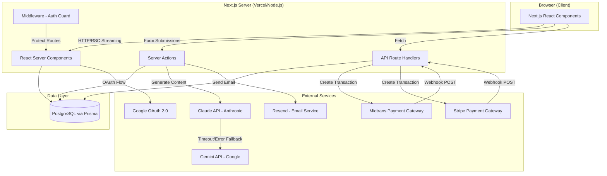
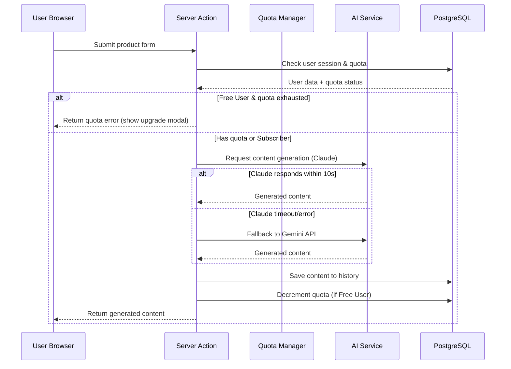
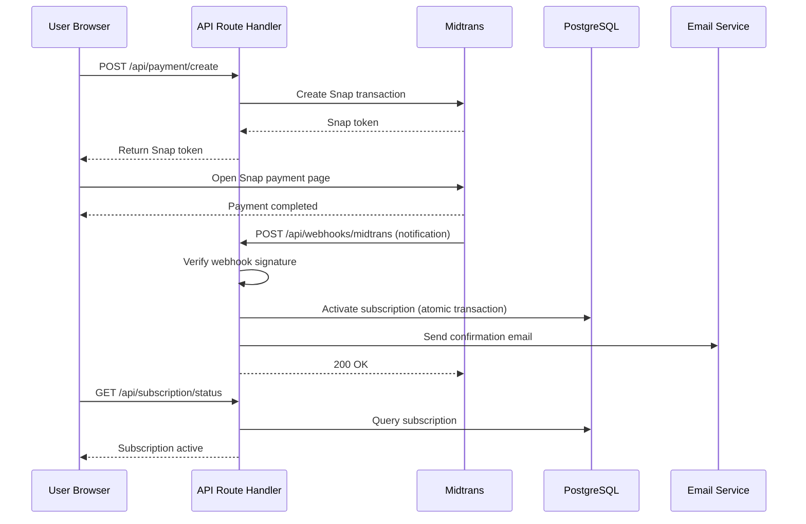
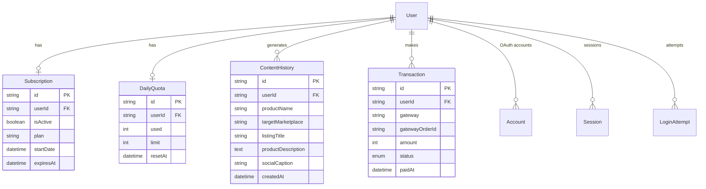

# Design Document: AI Content Generator SaaS

## Overview

AI Content Generator SaaS adalah platform web berbasis Next.js 14 (App Router) yang memungkinkan seller marketplace Indonesia menghasilkan konten produk berkualitas tinggi secara otomatis menggunakan AI. Platform ini mengadopsi arsitektur full-stack monolitik dengan Next.js sebagai framework utama, memanfaatkan Server Components untuk performa optimal dan Server Actions untuk mutasi data.

### Keputusan Arsitektur Utama

- **Next.js 14 App Router** — Server Components by default, mengurangi JavaScript bundle di client, mendukung streaming response dari AI API.
- **Prisma + PostgreSQL** — ORM type-safe dengan schema migration yang terstruktur; cocok untuk relasi kompleks antara user, subscription, quota, dan content history.
- **NextAuth v5 (Auth.js)** — Integrasi native dengan Next.js App Router; mendukung Credentials provider (email/password) dan Google OAuth 2.0.
- **Midtrans Snap** sebagai payment gateway utama (pasar Indonesia) + **Stripe** sebagai opsi internasional.
- **Claude API (Anthropic)** sebagai AI provider utama dengan **Gemini API (Google)** sebagai fallback otomatis.
- **Resend** untuk transactional email (verifikasi, reset password, notifikasi pembayaran).

### Ringkasan Temuan Riset

- Midtrans menyediakan official Node.js client (`midtrans-client`) dengan dukungan Snap (hosted payment page) dan Core API. Webhook notification dikirim ke endpoint server untuk konfirmasi pembayaran. ([Midtrans Docs](https://docs.midtrans.com/docs/snap-snap-integration-guide))
- NextAuth v5 mendukung App Router secara native dengan session management berbasis JWT atau database session. Middleware dapat melindungi route secara edge-compatible. ([NextAuth Docs](https://next-auth.js.org))
- Pola quota management yang umum di SaaS Next.js menggunakan database counter dengan atomic increment/decrement via Prisma transactions untuk mencegah race condition.
- Claude API Node.js SDK (`@anthropic-ai/sdk`) mendukung timeout configuration dan error handling yang memungkinkan implementasi fallback ke Gemini API.

---

## Architecture

### High-Level Architecture



### Request Flow: Content Generation



### Request Flow: Payment & Subscription Activation



---

## Components and Interfaces

### Module Structure

```
src/
├── app/
│   ├── (auth)/
│   │   ├── login/page.tsx
│   │   ├── register/page.tsx
│   │   └── forgot-password/page.tsx
│   ├── (dashboard)/
│   │   ├── dashboard/page.tsx
│   │   ├── generate/page.tsx
│   │   └── subscription/page.tsx
│   └── api/
│       ├── auth/[...nextauth]/route.ts
│       ├── payment/
│       │   ├── create/route.ts
│       │   └── status/route.ts
│       ├── webhooks/
│       │   ├── midtrans/route.ts
│       │   └── stripe/route.ts
│       └── quota/reset/route.ts  (cron endpoint)
├── lib/
│   ├── auth.ts              (NextAuth config)
│   ├── prisma.ts            (Prisma client singleton)
│   ├── ai-service.ts        (Claude + Gemini orchestration)
│   ├── quota-manager.ts     (Quota check & decrement)
│   ├── payment-service.ts   (Midtrans + Stripe)
│   ├── subscription-manager.ts
│   └── email-service.ts     (Resend)
├── actions/
│   ├── auth.actions.ts      (register, login, logout)
│   ├── content.actions.ts   (generate content)
│   └── subscription.actions.ts
└── components/
    ├── ui/                  (shadcn/ui base components)
    ├── content-generator/
    ├── dashboard/
    └── subscription/
```

### Core Interfaces (TypeScript)

```typescript
// Content Generation
interface ContentGenerationInput {
  productName: string;           // wajib
  category: string;              // wajib
  features: string[];            // wajib, minimal 3 item
  price?: number;                // opsional
  targetMarketplace: Marketplace; // wajib
  tone: ContentTone;             // wajib
}

type Marketplace = 'tokopedia' | 'shopee' | 'lazada' | 'bukalapak' | 'all';
type ContentTone = 'formal' | 'santai' | 'promosi';

interface GeneratedContent {
  listingTitle: string;          // maks 70 karakter (Tokopedia) / 120 (Shopee)
  productDescription: string;   // 300–500 kata
  socialCaption: string;        // maks 280 karakter
  marketplace: Marketplace;
  generatedAt: Date;
}

// AI Service
interface AIServiceRequest {
  input: ContentGenerationInput;
  systemPrompt: string;
}

interface AIServiceResponse {
  content: GeneratedContent;
  provider: 'claude' | 'gemini';
  latencyMs: number;
}

// Quota
interface QuotaStatus {
  userId: string;
  used: number;
  limit: number;                 // 5 untuk Free_User, Infinity untuk Subscriber
  resetAt: Date;                 // 00:00 WIB hari berikutnya
  isSubscriber: boolean;
}

// Payment
interface PaymentCreateRequest {
  userId: string;
  planId: 'unlimited-monthly';
  gateway: 'midtrans' | 'stripe';
}

interface PaymentCreateResponse {
  transactionId: string;
  snapToken?: string;            // untuk Midtrans Snap
  stripeClientSecret?: string;  // untuk Stripe
  expiresAt: Date;
}

// Subscription
interface SubscriptionStatus {
  userId: string;
  isActive: boolean;
  startDate: Date | null;
  expiresAt: Date | null;
  daysRemaining: number | null;
  plan: 'free' | 'unlimited';
}
```

### AI Service: Claude + Gemini Orchestration

```typescript
// lib/ai-service.ts
async function generateContent(
  input: ContentGenerationInput
): Promise<AIServiceResponse> {
  const prompt = buildMarketplacePrompt(input);
  
  try {
    // Primary: Claude API dengan timeout 10 detik
    const result = await Promise.race([
      callClaudeAPI(prompt),
      timeout(10_000, new Error('Claude API timeout'))
    ]);
    return { ...result, provider: 'claude' };
  } catch (error) {
    // Fallback: Gemini API
    console.warn('Claude API failed, falling back to Gemini:', error.message);
    const result = await callGeminiAPI(prompt);
    return { ...result, provider: 'gemini' };
  }
}

function buildMarketplacePrompt(input: ContentGenerationInput): string {
  // Membangun system prompt yang spesifik per marketplace dan tone
  // Menyertakan instruksi karakter limit, format, dan konteks lokal Indonesia
}
```

### Quota Manager: Atomic Operations

```typescript
// lib/quota-manager.ts
async function checkAndDecrementQuota(userId: string): Promise<QuotaCheckResult> {
  return await prisma.$transaction(async (tx) => {
    const user = await tx.user.findUnique({
      where: { id: userId },
      include: { subscription: true, dailyQuota: true }
    });

    if (user.subscription?.isActive) {
      return { allowed: true, isSubscriber: true };
    }

    const quota = user.dailyQuota;
    if (quota.used >= quota.limit) {
      return { allowed: false, remaining: 0 };
    }

    await tx.dailyQuota.update({
      where: { userId },
      data: { used: { increment: 1 } }
    });

    return { allowed: true, remaining: quota.limit - quota.used - 1 };
  });
}
```

---

## Data Models

### Prisma Schema

```prisma
// prisma/schema.prisma

generator client {
  provider = "prisma-client-js"
}

datasource db {
  provider = "postgresql"
  url      = env("DATABASE_URL")
}

model User {
  id              String    @id @default(cuid())
  email           String    @unique
  name            String
  passwordHash    String?   // null untuk OAuth users
  emailVerified   DateTime?
  image           String?
  createdAt       DateTime  @default(now())
  updatedAt       DateTime  @updatedAt

  // Relations
  accounts        Account[]
  sessions        Session[]
  subscription    Subscription?
  dailyQuota      DailyQuota?
  contentHistory  ContentHistory[]
  transactions    Transaction[]
  loginAttempts   LoginAttempt[]

  @@map("users")
}

// NextAuth required tables
model Account {
  id                String  @id @default(cuid())
  userId            String
  type              String
  provider          String
  providerAccountId String
  refresh_token     String? @db.Text
  access_token      String? @db.Text
  expires_at        Int?
  token_type        String?
  scope             String?
  id_token          String? @db.Text
  session_state     String?

  user User @relation(fields: [userId], references: [id], onDelete: Cascade)

  @@unique([provider, providerAccountId])
  @@map("accounts")
}

model Session {
  id           String   @id @default(cuid())
  sessionToken String   @unique
  userId       String
  expires      DateTime

  user User @relation(fields: [userId], references: [id], onDelete: Cascade)

  @@map("sessions")
}

model VerificationToken {
  identifier String
  token      String   @unique
  expires    DateTime

  @@unique([identifier, token])
  @@map("verification_tokens")
}

model Subscription {
  id          String    @id @default(cuid())
  userId      String    @unique
  isActive    Boolean   @default(false)
  plan        String    @default("unlimited") // "unlimited"
  startDate   DateTime?
  expiresAt   DateTime?
  createdAt   DateTime  @default(now())
  updatedAt   DateTime  @updatedAt

  user User @relation(fields: [userId], references: [id], onDelete: Cascade)

  @@map("subscriptions")
}

model DailyQuota {
  id        String   @id @default(cuid())
  userId    String   @unique
  used      Int      @default(0)
  limit     Int      @default(5)
  resetAt   DateTime // 00:00 WIB hari berikutnya
  updatedAt DateTime @updatedAt

  user User @relation(fields: [userId], references: [id], onDelete: Cascade)

  @@map("daily_quotas")
}

model ContentHistory {
  id                String    @id @default(cuid())
  userId            String
  productName       String
  category          String
  targetMarketplace String
  tone              String
  listingTitle      String
  productDescription String   @db.Text
  socialCaption     String
  aiProvider        String    // "claude" | "gemini"
  isDeleted         Boolean   @default(false)
  createdAt         DateTime  @default(now())

  user User @relation(fields: [userId], references: [id], onDelete: Cascade)

  @@index([userId, createdAt(sort: Desc)])
  @@map("content_history")
}

model Transaction {
  id              String    @id @default(cuid())
  userId          String
  gateway         String    // "midtrans" | "stripe"
  gatewayOrderId  String    @unique // order_id di Midtrans / payment_intent di Stripe
  amount          Int       // dalam Rupiah (IDR)
  currency        String    @default("IDR")
  status          TransactionStatus @default(PENDING)
  paymentMethod   String?   // "bank_transfer", "gopay", "credit_card", dll
  paidAt          DateTime?
  expiresAt       DateTime?
  createdAt       DateTime  @default(now())
  updatedAt       DateTime  @updatedAt

  user User @relation(fields: [userId], references: [id], onDelete: Cascade)

  @@index([userId])
  @@map("transactions")
}

enum TransactionStatus {
  PENDING
  SUCCESS
  FAILED
  EXPIRED
  CANCELLED
}

model LoginAttempt {
  id        String   @id @default(cuid())
  userId    String?
  email     String
  ipAddress String?
  success   Boolean
  createdAt DateTime @default(now())

  user User? @relation(fields: [userId], references: [id], onDelete: SetNull)

  @@index([email, createdAt])
  @@map("login_attempts")
}

model PasswordResetToken {
  id        String   @id @default(cuid())
  email     String
  token     String   @unique
  expiresAt DateTime
  usedAt    DateTime?
  createdAt DateTime @default(now())

  @@index([email])
  @@map("password_reset_tokens")
}
```

### Relasi Antar Model



---

## Correctness Properties

*A property is a characteristic or behavior that should hold true across all valid executions of a system — essentially, a formal statement about what the system should do. Properties serve as the bridge between human-readable specifications and machine-verifiable correctness guarantees.*

### Property 1: Quota Decrement Consistency

*For any* Free_User with remaining quota > 0, after a successful content generation, the quota used count SHALL increase by exactly 1 and the remaining count SHALL decrease by exactly 1.

**Validates: Requirements 3.3**

---

### Property 2: Quota Exhaustion Blocks Generation

*For any* Free_User whose daily quota used equals the daily limit (5), any attempt to generate content SHALL be rejected and the quota used count SHALL remain unchanged.

**Validates: Requirements 3.4**

---

### Property 3: Subscriber Bypass Quota

*For any* user with an active subscription, the content generation request SHALL be allowed regardless of the daily quota counter value (including when counter equals the free limit).

**Validates: Requirements 3.5**

---

### Property 4: Quota Reset Idempotency

*For any* set of Free_Users with any usage state (0–5 used), after the daily quota reset operation runs, every Free_User's quota used count SHALL equal 0 — and applying the reset operation a second time SHALL produce the same result (idempotent).

**Validates: Requirements 3.6**

---

### Property 5: Content Generation Round-Trip Persistence

*For any* valid content generation input, after a successful generation, querying the user's content history SHALL return a record containing the same product name, target marketplace, tone, and all three generated content fields (listing title, description, caption).

**Validates: Requirements 2.10**

---

### Property 6: Webhook Activates Subscription with Correct Expiry

*For any* user with a PENDING transaction, when a webhook notification with status `settlement` or `capture` is received for that transaction's order ID, the user's subscription SHALL be set to active AND the expiry date SHALL be exactly 30 days from the activation timestamp.

**Validates: Requirements 4.5, 4.7**

---

### Property 7: Subscription Renewal Extends from Previous Expiry

*For any* active Subscriber who renews before their current expiry date, the new expiry date SHALL equal the previous expiry date plus exactly 30 days — not 30 days from the payment date.

**Validates: Requirements 6.4**

---

### Property 8: Input Sanitization Preserves Valid Content

*For any* valid product input (non-empty name, valid category, ≥3 features), after sanitization the sanitized input SHALL still produce a non-empty prompt — sanitization SHALL only remove/escape potentially malicious injection patterns, not valid product information.

**Validates: Requirements 8.5**

---

### Property 9: Password Hashing Correctness

*For any* plaintext password, the stored bcrypt hash SHALL never equal the plaintext password string, verifying the correct plaintext against the hash SHALL return true, and verifying any different string against the hash SHALL return false.

**Validates: Requirements 8.1**

---

### Property 10: Marketplace-Specific Title Length Constraints

*For any* valid product input targeting Tokopedia, the generated listing title length SHALL be between 40 and 70 characters (inclusive). *For any* valid product input targeting Shopee, the generated listing title length SHALL be between 25 and 120 characters (inclusive). *For any* valid product input targeting "Semua Marketplace", the generated listing title length SHALL be at most 70 characters.

**Validates: Requirements 2.2, 7.1, 7.2, 7.3**

---

### Property 11: AI Fallback Transparency

*For any* content generation request where the Claude API fails (timeout or error), the system SHALL automatically call the Gemini API and return valid generated content — the user SHALL receive content regardless of which provider responded.

**Validates: Requirements 2.4**

---

### Property 12: Tone Selection Affects Prompt Construction

*For any* valid product input, the prompt constructed for the AI service SHALL contain tone-specific instructions: "santai" tone prompts SHALL include informal language and emoji guidance; "formal" tone prompts SHALL include formal language and no-emoji instructions; "promosi" tone prompts SHALL include persuasive language and call-to-action instructions.

**Validates: Requirements 7.5, 7.6, 7.7**

---

### Property 13: Account Lockout After Repeated Failures

*For any* user account, after exactly 5 consecutive failed login attempts within a 15-minute window, the 6th login attempt SHALL be rejected with a lockout error regardless of whether the credentials are correct.

**Validates: Requirements 8.4**

---

### Property 14: Generic Login Error Message

*For any* invalid credential combination (wrong email, wrong password, or both), the error message returned SHALL always be the same generic string — the system SHALL NOT reveal which specific field was incorrect.

**Validates: Requirements 1.7**

---

### Property 15: Content History Sorted by Recency

*For any* user with multiple content history records, querying the history SHALL always return records sorted in descending order by creation date (newest first), regardless of the order in which they were created.

**Validates: Requirements 5.3**

---

### Property 16: No Raw Card Data Stored

*For any* payment transaction processed through Midtrans or Stripe, the transaction record stored in the database SHALL NOT contain raw card numbers, CVV, or full card data — only gateway-provided tokens or masked identifiers.

**Validates: Requirements 8.6**

---

## Error Handling

### AI Service Error Handling

| Kondisi Error | Strategi |
|---|---|
| Claude API timeout (>10 detik) | Fallback otomatis ke Gemini API |
| Claude API error (5xx, rate limit) | Fallback otomatis ke Gemini API |
| Gemini API juga gagal | Return error 503 ke user dengan pesan "Layanan AI sedang tidak tersedia, coba lagi dalam beberapa menit" |
| Konten dihasilkan tapi tidak valid (terlalu pendek) | Retry sekali dengan prompt yang dimodifikasi |

### Payment Webhook Error Handling

| Kondisi | Strategi |
|---|---|
| Webhook signature tidak valid | Return 400, log security warning |
| Transaksi tidak ditemukan di DB | Return 404, log untuk investigasi |
| Duplikat webhook (idempotency) | Cek status transaksi; jika sudah SUCCESS, return 200 tanpa proses ulang |
| Database error saat aktivasi | Return 500, Midtrans akan retry webhook; gunakan idempotency key |

### Authentication Error Handling

| Kondisi | Strategi |
|---|---|
| Email sudah terdaftar | Error message spesifik (Req 1.3) |
| Login gagal | Generic error tanpa mengungkapkan field mana yang salah (Req 1.7) |
| 5 kali gagal login dalam 15 menit | Lock akun 15 menit + kirim email notifikasi (Req 8.4) |
| Reset password token expired | Tampilkan error + tawarkan kirim ulang (Req 1.9) |
| Email service tidak tersedia saat registrasi | Tetap selesaikan registrasi, sediakan opsi resend (Req 1.2) |

### Quota Race Condition Prevention

Semua operasi quota (check + decrement) dijalankan dalam satu Prisma transaction dengan `SELECT FOR UPDATE` semantics untuk mencegah race condition ketika user melakukan multiple concurrent requests.

```typescript
// Contoh atomic quota check-and-decrement
await prisma.$transaction(async (tx) => {
  const quota = await tx.dailyQuota.findUnique({
    where: { userId },
    // Prisma menggunakan SELECT ... FOR UPDATE dalam transaction
  });
  if (quota.used >= quota.limit) throw new QuotaExhaustedError();
  await tx.dailyQuota.update({
    where: { userId },
    data: { used: { increment: 1 } }
  });
});
```

### HTTP Error Response Format

```typescript
interface APIErrorResponse {
  error: {
    code: string;       // e.g., "QUOTA_EXHAUSTED", "PAYMENT_FAILED"
    message: string;    // Pesan dalam Bahasa Indonesia untuk user
    details?: unknown;  // Informasi tambahan (hanya di development)
  };
}
```

---

## Testing Strategy

### Pendekatan Dual Testing

Platform ini menggunakan dua lapisan pengujian yang saling melengkapi:

1. **Unit Tests** — Menguji contoh spesifik, edge case, dan kondisi error
2. **Property-Based Tests** — Menguji properti universal yang harus berlaku untuk semua input valid

### Property-Based Testing

Library yang digunakan: **fast-check** (TypeScript/JavaScript)

Setiap property test dikonfigurasi dengan minimum **100 iterasi** dan diberi tag referensi ke properti desain.

```typescript
// Contoh: Property 1 - Quota Decrement Consistency
import fc from 'fast-check';
import { describe, it, expect } from 'vitest';

// Feature: ai-content-generator-saas, Property 1: Quota Decrement Consistency
describe('Quota Manager', () => {
  it('decrements quota by exactly 1 on successful generation', async () => {
    await fc.assert(
      fc.asyncProperty(
        fc.integer({ min: 1, max: 5 }), // remaining quota
        async (remaining) => {
          const initialUsed = 5 - remaining;
          const { used: newUsed } = await checkAndDecrementQuota(mockUserId, initialUsed);
          expect(newUsed).toBe(initialUsed + 1);
        }
      ),
      { numRuns: 100 }
    );
  });
});
```

### Unit Tests

Unit tests difokuskan pada:
- **Validasi input** — field wajib, format email, panjang password, jumlah fitur produk
- **Prompt building** — `buildMarketplacePrompt()` menghasilkan prompt yang benar per marketplace dan tone
- **Webhook signature verification** — Midtrans dan Stripe signature validation
- **Subscription date calculation** — perpanjangan menambah 30 hari dari expiry lama, bukan dari tanggal bayar
- **Error conditions** — quota exhausted, expired subscription, invalid token

### Integration Tests

Integration tests (dengan database test dan mock AI/payment services):
- **Auth flow** — registrasi → verifikasi email → login → logout
- **Content generation flow** — submit form → quota check → AI call → save history
- **Payment flow** — create transaction → webhook → subscription activation
- **Quota reset** — cron endpoint mereset semua Free_User quota ke 0

### Test Configuration

```typescript
// vitest.config.ts
export default defineConfig({
  test: {
    environment: 'node',
    setupFiles: ['./tests/setup.ts'],
    coverage: {
      provider: 'v8',
      include: ['src/lib/**', 'src/actions/**'],
      exclude: ['src/app/**', 'src/components/**']
    }
  }
});
```

### Cakupan Test per Modul

| Modul | Unit Tests | Property Tests | Integration Tests |
|---|---|---|---|
| `quota-manager.ts` | ✓ | ✓ (Property 1, 2, 3, 4) | ✓ |
| `ai-service.ts` | ✓ | ✓ (Property 8, 10, 11, 12) | ✓ (mock) |
| `payment-service.ts` | ✓ | ✓ (Property 16) | ✓ (sandbox) |
| `subscription-manager.ts` | ✓ | ✓ (Property 6, 7) | ✓ |
| `auth.actions.ts` | ✓ | ✓ (Property 9, 13, 14) | ✓ |
| `content.actions.ts` | ✓ | ✓ (Property 5, 15) | ✓ |

### Catatan: Mengapa PBT Tidak Diterapkan pada Beberapa Area

- **UI Components** — Komponen React diuji dengan snapshot tests (Storybook) dan example-based tests (React Testing Library), bukan PBT.
- **Webhook handlers** — Perilaku tidak bervariasi secara bermakna dengan input; diuji dengan 2–3 contoh representatif (integration tests).
- **Email sending** — Side-effect only; diuji dengan mock-based unit tests untuk memverifikasi bahwa fungsi email dipanggil dengan parameter yang benar.
- **Database migrations** — Diuji dengan smoke tests (schema validation).
